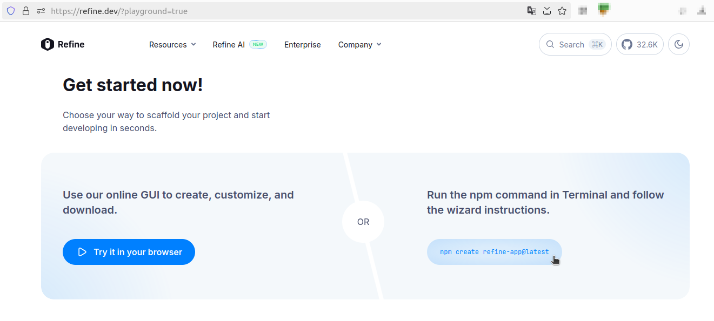
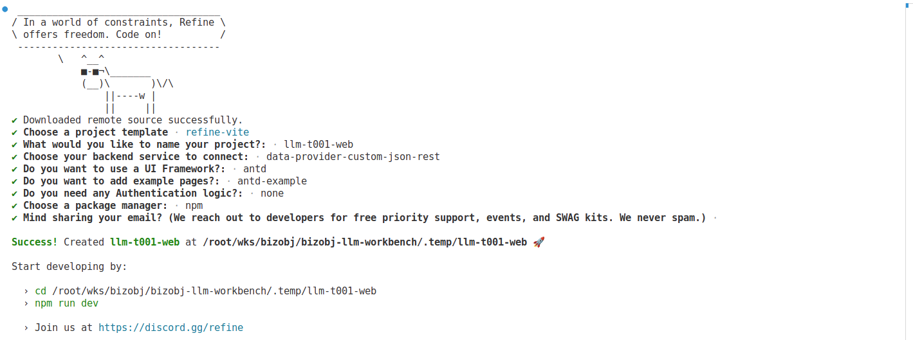

# The "frontend" Module

This module contains the frontend resource for the BizObj LLM T001 project.

## Architecture

The frontend is built using [Refine](https://refine.dev/) (based on React and TypeScript), providing a user-friendly interface for interacting with the backend services. It communicates with the backend via RESTful APIs to fetch and display data.

## References

### Project creation

Run `npm create refine-app@latest` :

